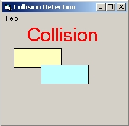



## MJD Simple Collision Detection

### Description

Very Simple Collision Detection.

The intent here is for simple collision detection between two shapes only. Speed and precision were not needed, nor considered.

Mostly Written by MDavis, with credit given to Rosh Mendis (very cool soccer game post on PSC!) for the actual collision function.

I'm fairly new to VB and I needed a collision detection for a small game I am writing.

My web searches led me to complicated (to me, anyway:)) posts that had a lot more than just collision, which confused me.

So, I wrote this to learn more for myself, and now that I understand it better, I thought I'd post it to possibly help someone else.
 
### More Info
 
Laughing at the simplicity, perhaps?

             |
---                |---
**Submitted On**   |2001-08-01 11:27:28
**By**             |[MDavis](https://github.com/Planet-Source-Code/PSCIndex/blob/master/ByAuthor/mdavis.md)
**Level**          |Beginner
**User Rating**    |4.0 (8 globes from 2 users)
**Compatibility**  |VB 6\.0
**Category**       |[Graphics](https://github.com/Planet-Source-Code/PSCIndex/blob/master/ByCategory/graphics__1-46.md)
**World**          |[Visual Basic](https://github.com/Planet-Source-Code/PSCIndex/blob/master/ByWorld/visual-basic.md)
**Archive File**   |[MJD Simple23882812001\.zip](https://github.com/Planet-Source-Code/mdavis-mjd-simple-collision-detection__1-25732/archive/master.zip)

